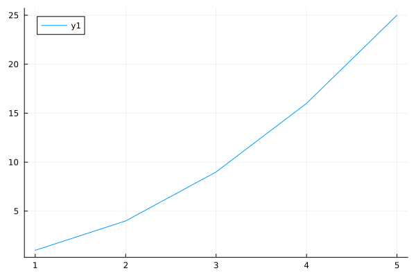
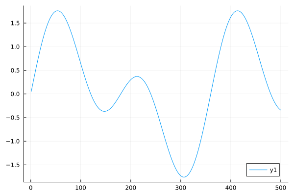
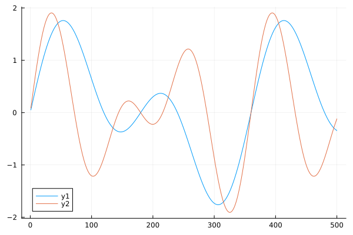

### EXPERIMENT 10:
~~~
A. Develop a Julia program to generate a plot of (solid & dotted) a function: y=x^2 (use suitable data points for x).

B. Develop a Julia program to generate a plot of mathematical equation: y = sin(x) + sin(2x).

C. Develop a Julia program to generate multiple plots of mathematical equations: y = sin(x) + sin(2x) and y= sin(2x) + sin(3x).
~~~

**JL10A.jl OUTPUT :**

**JL10B.jl OUTPUT :**

**JL10C.jl OUTPUT :**
